# DA14531 Quuppa Tag Emu example

## Example description

### Quuppa technology overview

The Quuppa Intelligent Locating System™ is a powerful engine for various location-based services and applications. It provides accurate (down to few centimeters) real-time (location update rate of up to 50 Hz, and latency down to 100 ms) positioning data using Bluetooth® Low Energy (Bluetooth LE) technology, unique Direction Finding signal processing methods and advanced proprietary algorithms.

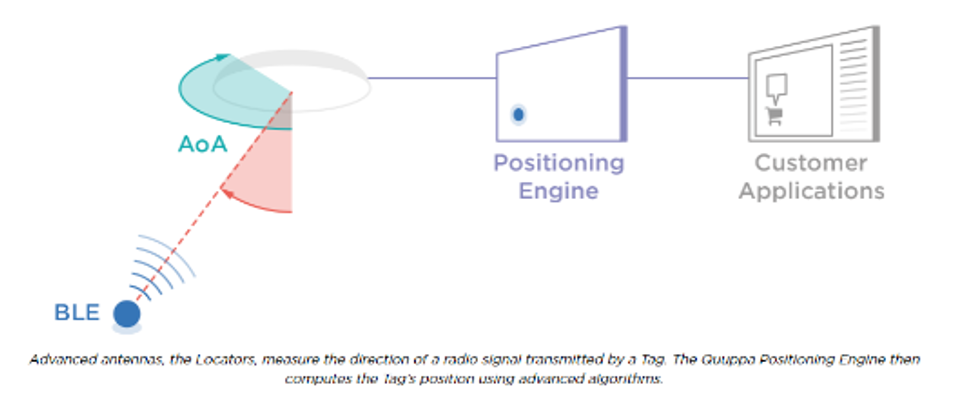

### Capacity of Quuppa solution

Quuppa system can support up to 400-500 Quuppa radio packets per second in a "same location" without major impact to the system performance. 

The Quuppa radio packets can be generated by either:
* tens of tags using fast TX rate
* thousands of tags using slow TX rate
* anything in between. 

Note, that when BLE mode is used there may be other BLE radio packets in the air that also contribute to that 400-500 packets limit. Also, Data Packets contribute to that packet limit.

For defining the "same location" a concept of detection area can be used. 
Detection area is the area within which a Locator can detect a tag but cannot necessarily estimate the position of the tag accurately. Typical radius for a detection area is about 30-60 meters but it can vary from 5 to 300 meters depending on the tag’s TX power and used locator type. The smaller the used detection area, the greater the total system capacity.

It is important to understand that the 400-500 packets/second limit only defines how many tags can be active in a given location at a given time. For example in a large deployment such as a warehouse, there can be tens of thousands of tags being tracked around the facility. The only limitation is that all tags cannot be tracked accurately at a given time if they all happen to be active at the same location at the same time.

### Quuppa Tag Emulation

Quuppa Tag emulation may be implemented with any device that supports Low Energy Advertising State as defined in Bluetooth ⓇCore Specification version 4.0 and higher.

For example a smartphone running Android 5.0 and Bluetooth version 4.1 can perform Quuppa Tag emulation.  

A device emulating Quuppa Tag shall send Quuppa Direction Finding and Quuppa Data packets as specified in Quuppa Tag Emulation using Bluetooth Ⓡ Wireless Technology v1.3 document.

A system employing Quuppa Intelligent Locating Technology ™ can accurately track the position of Quuppa Tags as well as receive and expose data transmitted by Quuppa Tags.

Quuppa Direction Finding packets are used for position tracking whereas Quuppa Data packets are used for data transfer.

Quuppa assigned 0x0080 to Dialog as Developer ID

### Quuppa Direction Finding Packet (Packet ID = 0x01)

Advertising data of Quuppa DF packet and a complete BLE Link Layer packet formatted as Quuppa DF packet is shown below:

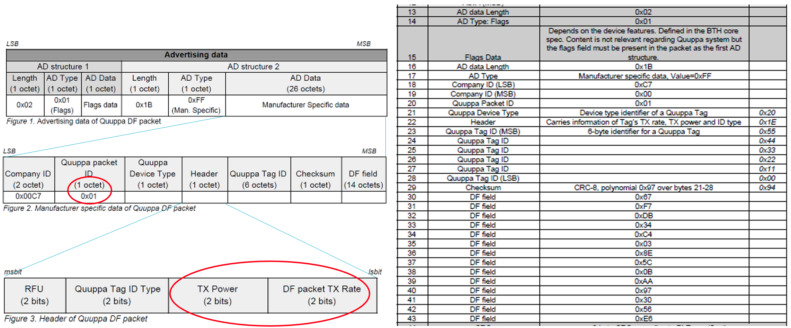

### Quuppa Direction Finding Packet : Device Type and Header

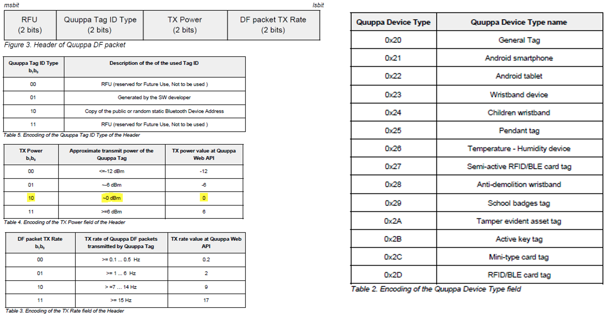

### Quuppa Data Packets

A device emulating Quuppa Tag may use the payload field of the Quuppa Data Packet to transmit data which will be exposed through the Quuppa Web Services API.

Different payload formats may be interleaved in any order.
Whenever the content of the payload data is updated or payload is intended to be considered new by the receiver the Payload Counter in the header of the Quuppa data packet shall be updated.

Note, as the data transmission is based on broadcasting, there is no guarantee that a certain single payload will be received by the receiver. Therefore it is advised to send “critical” data, such as button press, in several subsequent packets with incremented Payload Counter values.

Reserved for Future Use (RFU) octets in the payload shall be set to 0x00. RFU bits in the payload shall be set to ‘0’.

### Quuppa Data Packet (Packet ID = 0xF0)

Advertising data of Quuppa Data packet and a complete BLE Link Layer packet formatted as Quuppa Data packet using Device Info (0x01) payload is showed below:

### Quuppa Back Channel

Quuppa Tag Back Channel is a mechanism that allows the user of the Quuppa Intelligent Locating Technology ™ to write/read data to/from Quuppa Tags using Quuppa Web API.

The mechanism uses Quuppa Request (REQ) packets to carry data from Quuppa Locators to Quuppa tags and Quuppa Response (RSP) packets to carry response data from Quuppa Tags to Quuppa Locators. The Quuppa REQ and RSP packets are Non-Connectable Bluetooth Low Energy advertising packets with manufacturer specific advertising data.

Note, the Quuppa RSP packet shall only be used as a response for REQ packet. Simple data transmission from Quuppa Tag to Quuppa Web API via Quuppa Locators shall be done by using Quuppa Data packet.

The Quuppa Tag shall use the second significant bit of the Header field of Quuppa DF packet to inform whether it supports the Quuppa Tag Back Channel feature, if the tag supports the Back Channel feature the second significant bit shall be set to ‘1’ otherwise ‘0’.

The Quuppa Tag shall use the MSB bit of the Header field of Quuppa DF packet to inform whether it will have its receiver activated after the transmission of a particular DF packet, if the receiver is turned on after the transmission of the particular DF packet the RX ON bit shall be set to ‘1’ otherwise ‘0’.

The Quuppa Tag may use different delay values before turning on the receiver after transmitting a Quuppa DF packet with RX ON indication set high. 
The delay value depends on the value of the Quuppa Device Type octet in DF packet as specified in Table 1

After receiving a REQ packet a Quuppa Tag shall process the REQ packet and in case the packet is valid and intended for the Quuppa Tag, the Quuppa Tag shall respond with 3 identical Quuppa RSP packets always using BLE advertising channel index 37. 
The interval between the identical Quuppa RSP packets shall be at least 10 ms but no more than 200 ms.

The first RSP packet should be sent as soon as the REQ processing is done but latest within one second after receiving the REQ.

Advertising data of Quuppa REQ/RSP packet and a complete BLE Link Layer packet is shown below in case of Developer Data (0xFF) type:

The sequence diagram below outlines the Quuppa Back Channel operation

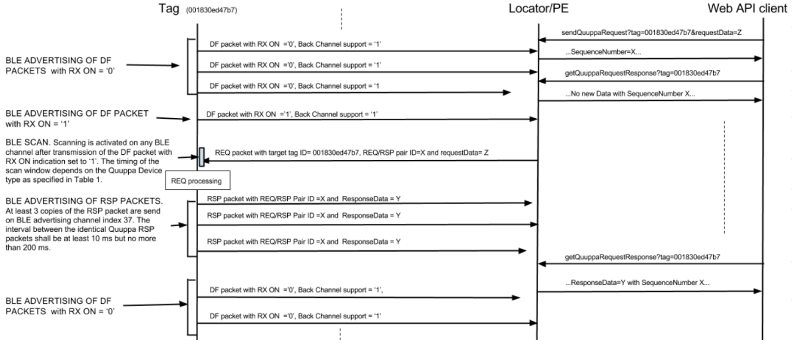

### Quuppa Tag Emulation Pro Profiles (To Be Implemented)

Quuppa Tag Emulation Pro profiles
A profile is  a collection of the tag state machine settings that should be included in the Quuppa Tag Emulation Pro library implementation as pre-configured parameters.
A profile can be recalled when the Tag is configured or with a specific Back Channel command.  
List of available profiles (as of v0.91)

1. Asset Tag
2. ID Badge
3. ID Badge Fast Alarm
4. Forklift / Vehicle
5. Forklift / Vehicle Fast RX Rate
6. Demo Tag
7. Powersave

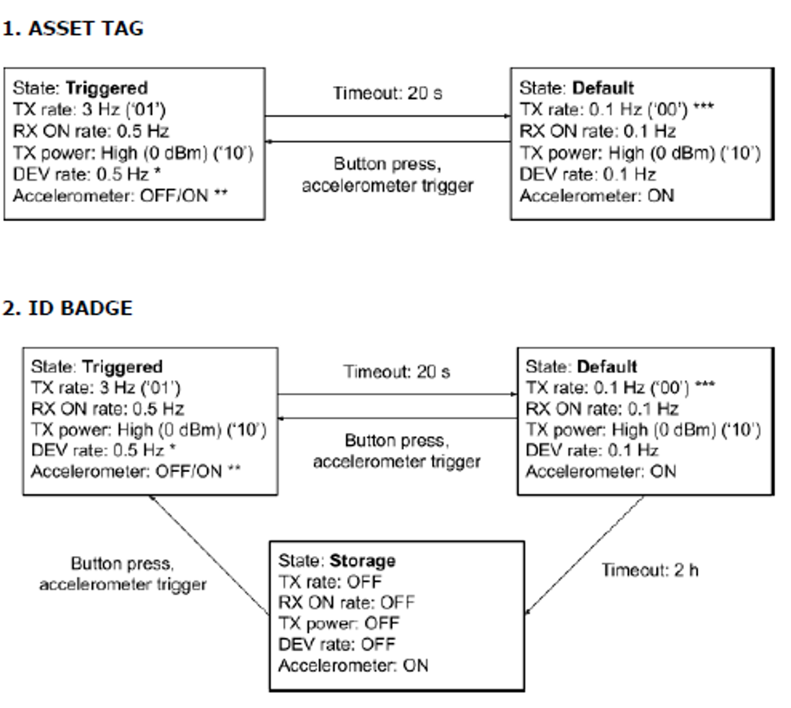

## HW & SW Configurations

- **Hardware Configurations**
    - This example runs on a DA14531 Bluetooth Smart SoC.
    - A DA14531 Pro Development Kit is needed for this example.
    - By default, the BME270 pins are configured for the BME270 click board in the MicroBUS socket of a module daughterboard.
- **Software Configurations**
    - Download the respective SDK version for the DA14531 family of devices (SDK_6.0.14.1114)
    - **Keil** software compiler
    - **SEGGER's J-Link** tools should be downloaded and installed.

## How to run the example

### Initial Setup

- For the initial setup, please refer to [this section](https://www.dialog-semiconductor.com/sites/default/files/sw-example-da145x-example-setup.pdf).

- For the DA14531 Getting started guide you can refer to this [link](https://www.dialog-semiconductor.com/da14531-getting-started).

The BME270 should be connected as described in the block diagram:

### Quuppa Profiles and Device Info (DEV) packet in the DEMO SW

Two simplified version of ID BADGE and FORKLIFT/VEHICLE FAST RX RATE profiles has been implemented in the demo sw as pre-compiled options:
* Setting Device Type 0x20 => ID BADGE profile is implemented
    * Scan delay after RXON =1 => 250ms
    * Scan window => 250ms 
* Setting Device Type 0x80 => FORKLIFT/VEHICLE FAST RX RATE is implemented
    * Scan delay after RXON =1 => 40ms
    * Scan window => 50ms
* BMI270 Accelerometer use embedded feature “ANY MOTION/NO_MOTION” with timeout set to 20sec
* Simplified version do not support:
    * Different rate for DEV and RXON (RXON rate = DEV rate)
    * Sending of five burst DEV info when button is pressed and released
    * Burst of five TX rate at 1Hz when transitioning from Triggered to Default state

Device Type 0x20 => ID BADGE

Device Type 0x80 => FORKLIFT/VEHICLE FAST RX

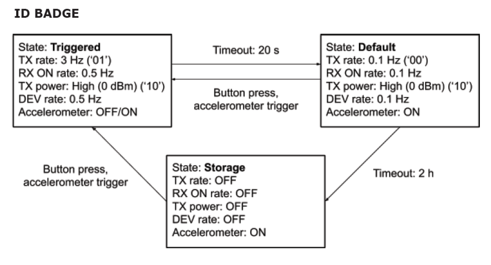

In order to change the tag ID one **DA14531_Quuppa_DF_BckChn_FlexBeacon.h**, Line 68 and edit the tag ID

### BLE Scanner Demo Sw testing

* SW2 button or accelerometer switch from Default to Triggered state

* Quuppa Device type 0x08
    * Triggered STATE (MOTION) 
        * Rate:
            * TX    =   9Hz (111ms)
            * RX    =   5Hz
            * DEV =   5Hz
        * Headers:
            * TX         = 0x6A
            * RX_ON = 0xE9
            * DEV      = 0xF0
    * Default STATE (STATIC)
        * Rate:
            * TX    =   0.1Hz (10000ms)
            * RX    =   0.1Hz
            * DEV =   0.1Hz
        * Headers:
            * TX         = 0x68
            * RX_ON = 0xE8
            * DEV      = 0xF0

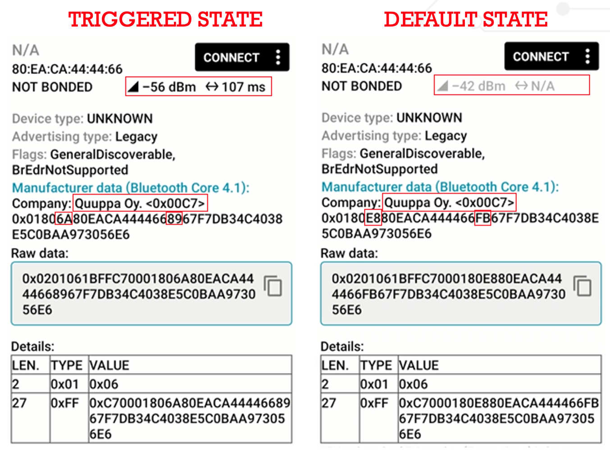

### Power profiles

#### Device Type 0x20 => ID BADGE

To distinguish in the power profile, RXON=1 adv has TX PW=2.5dBm, normal TX adv has TX PW=0dBm and DEV adv has TX PW=-7dBm 
Here DA14531 is in extended sleep between adv, you can see that from the avg current of 11.7uA

Here DA14531 is in extended sleep between adv, you can see that from the avg current of 11.7uA
Toggle LED command received and processed

Here DA14531 is in extended sleep between adv, you can see that from the avg current of 10.9uA
Toggle LED command received and processed

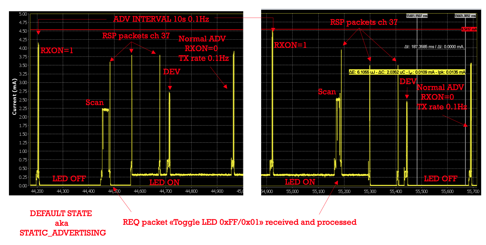

#### Device Type 0x80 => FORKLIFT/VEHICLE FAST RX

To distinguish in the power profile, RXON=1 adv has TX PW=2.5dBm, normal TX adv has TX PW=0dBm and DEV adv has TX PW=-7dBm 
Here DA14531 is in extended sleep between adv, you can see that from the avg current of 13.8uA
Toggle LED command received and processed

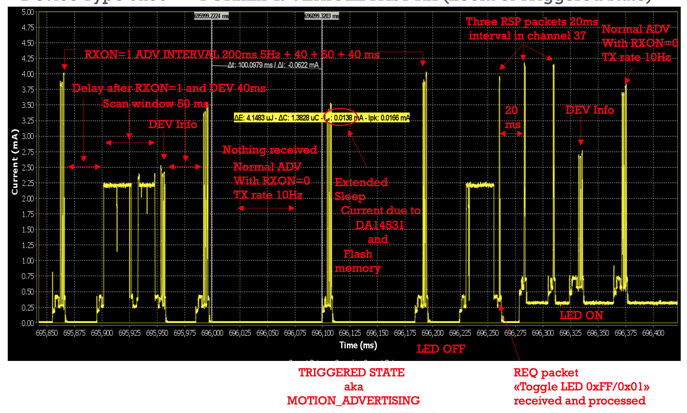

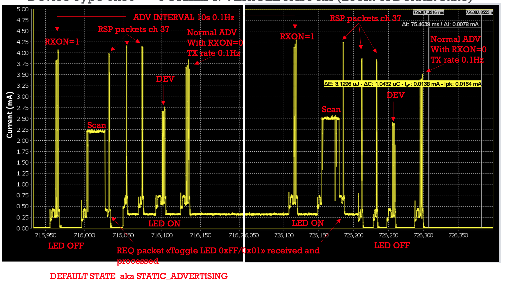

### Quuppa Back Channel testing with Web Console API

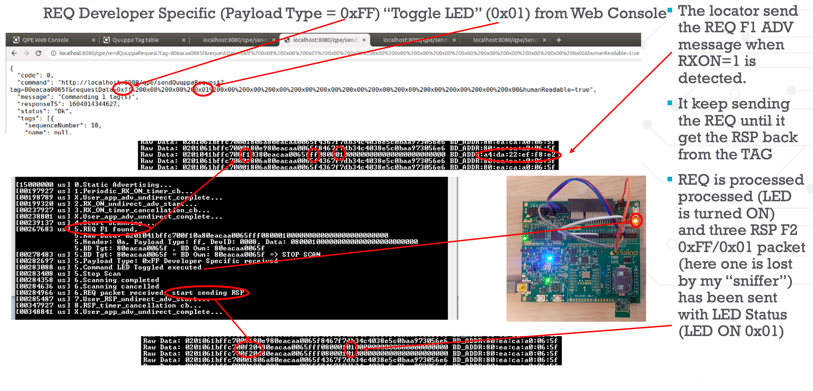

### Compile & Run

- Νavigate to the `project_environment` folder and open the `Keil` project.
- Compile and launch the example. You should download the firmware either into System-RAM or SPI Flash through the SPI Flash programmer of the SmartSnippets Toolbox. When booting from SPI Flash, jumpers should be placed on the standard SPI flash setup.

## Known limitations

- Refer to the following application note for [DA14531 known hardware limitations](https://www.dialog-semiconductor.com/da14531_HW_Limitation  "known hardware limitations"). 
- Dialog Software [Forum link](https://www.dialog-semiconductor.com/forum).

