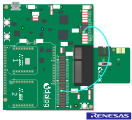
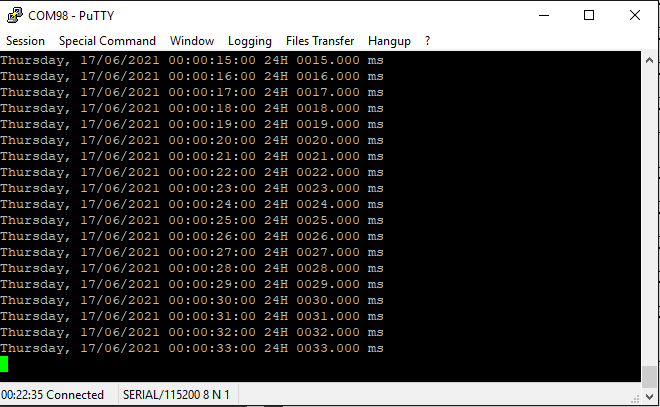
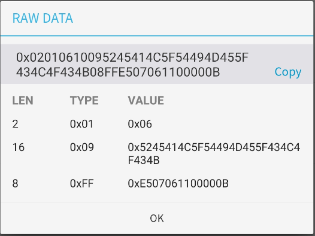
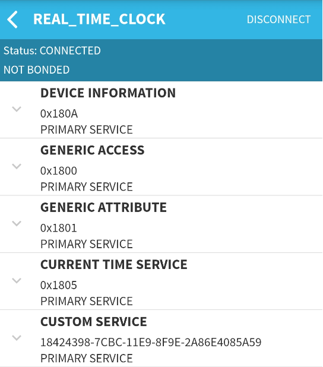
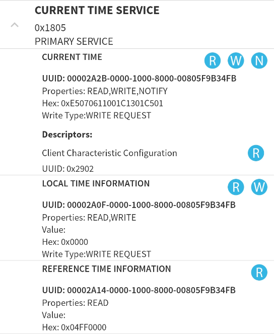
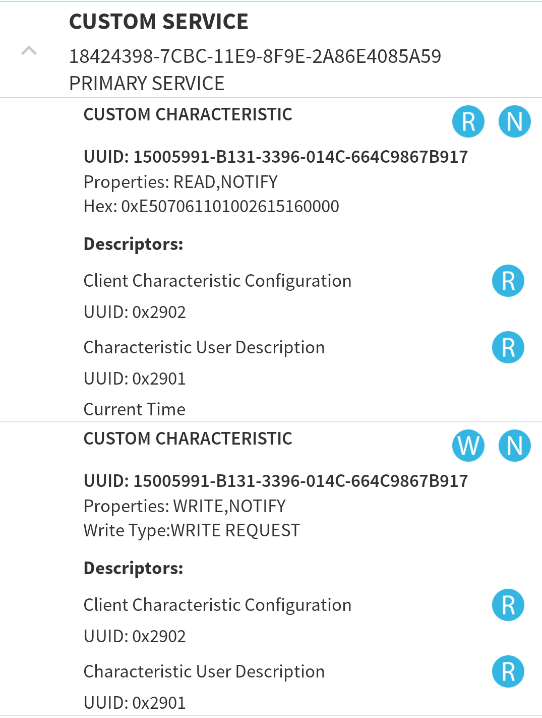

# Real Time Clock example 

## Example description

The main purpose of this SW example is to demonstrate how to configure the RTC in order to keep time while the BLE is operating as well as use the **EVENTS** and **ALARMS** available on the RTC HW.

## Features

- Advertise the current Time/Date
- Print out the current time and date on RTC **EVENT**.
- Use the RTC **EVENT** function for updating the advertising string.
- Expose the SIG CTS profile (Current Time Service) with all optional features enabled.
- Expose a Custom (128-bit) profile for Time Read/Notify/Update and Alarm setting. 
- Expose the RTC **ALARM** function for setting alarms via custom profile.

## How it works

### SDK modifications

If the CTS SIG profile is used some minor modifications should take place in order for the profile to operate properly. The modifications that should take place expose a callback function in application level that serves the Read operation of the Local Time Information characteristic. The changes are indicated below:

1.  Add the new read callback holder in the **app_ctss.h** file as a member of the existing struct app_ctss_cb. The updated struct should look like below:
```c
/// CTSS APP callbacks
struct app_ctss_cb
{
    /// Callback upon 'cur_time_read_req'
    void (*on_cur_time_read_req)(struct cts_curr_time *ct);

    /// Callback upon 'cur_time_write_req'
    uint8_t (*on_cur_time_write_req)(const struct cts_curr_time *ct);

    /// Callback upon 'cur_time_notified'
    void (*on_cur_time_notified)(uint8_t status);

    /// New callback upon 'loc_time_info_read_req'
    void (*on_loc_time_info_read_req)(struct cts_loc_time_info *lt);

    /// Callback upon 'loc_time_info_write_req'
    void (*on_loc_time_info_write_req)(const struct cts_loc_time_info *lt);

    /// Callback upon 'ref_time_info_read_req'
    void (*on_ref_time_info_read_req)(struct cts_ref_time_info *rt);
};
```
2. After the holder is created add the invocation of the callback when the specific characteristic is read. The modification should be applied in the **app_ctss_task.c** file at the **ctss_read_req_ind_handler** in the switch case statement that handles the read of the specific characteristic **CTSS_IDX_LOCAL_TIME_INFO_VAL**. The updated code should look like below:
```c
...
    case CTSS_IDX_LOCAL_TIME_INFO_VAL:
        // Set information
        user_app_ctss_cb.on_loc_time_info_read_req(&local_time);
        data[0] = local_time.time_zone;
        data[1] = local_time.dst_offset;
        len = 2;
        break;
...
```
3. The assignement of the new callback is done in the user_callback_config.h file included in the source files of the example. 

### Demo Features Configuration 
- Printing current time and additional messages (an alarm, error codes) in UART is enabled via the definition PRINT_DATE_TIME_DATA in the user_config.h file. The date/time printing along with the advertising update its driven via an RTC event. Changing the definition ADVERTISE_UPDATE will affect the printing interval as well as the advertising update. The available options for the ADVERTISE_UPDATE definition are:
  - **RTC_EVENT_SEC** - Update the advertising string once every second.
  - **RTC_EVENT_MIN** - Update the advertising string once every minute.
  - **RTC_EVENT_HOUR** - Update the advertising string once every hour.
  - **RTC_EVENT_DATE** - Update the advertising string once every day.
  - **RTC_EVENT_MNTH** - Update the advertising string once every month.

- The profiles that are included in the demo can be configured via the **user_profiles_config.h** file via defining or un-defining the corresponding profile. The available profiles are:
  - **CFG_PRF_DISS** - Enable the Device Information Service SIG Profile.
  - **CFG_PRF_CTSS** - Enable the Current Time Service SIG Profile.
  - **CFG_PRF_CUSTS1** - Enable the custom time Profile.

### Device Information Service

This is a SIG adopted profile for exposing the Device's data over the Generic Attribute Profile. For more information regarding the profile itself refer to the Specification List on [SIG Website](https://www.bluetooth.com/specifications/specs/).

### Current Time Service Profile

This is a SIG adopted profile for exposing the current time of a peripheral over the Generic Attribute Profile. On top of the profile RTC functionalities are added in application layer. For more information regarding the profile itself refer to the Specification List on [SIG Website](https://www.bluetooth.com/specifications/specs/).

### Custom Time Profile
A 128-bit UUID custom service is also exposed with 3 custom characteristics for Reading, Updating, Notifying the time kept from the DA14531 RTC as well as setting the alarm functionality. 

<table>
  <caption> <b> <i> Custom Service 1 Characteristics Values and Properties</i></b></caption>
<thead>
  <tr class="header">
  <th style="text-align: left;">Characteristic Name</th>
  <th style="text-align: left;">Properties</th>
  <th style="text-align: left;">Length(Bytes)</th>
  <th style="text-align: left;">Format</th>
  <th style="text-align: left;">Description</th>
  </tr>
</thead>
<tbody>
  <tr class="odd">
  <td style="text-align: left;">Current Time</td>
  <td style="text-align: left;">Notify/Read</td>
  <td style="text-align: left;">11</td>
  <td style="text-align: left;">yyyy | mm | dd | wd | hr | min | sec | hos | hm | pm</td>
  <td style="text-align: left;">Returns the current value of the RTC. Enabling the notifications will force the peripheral to notify every APP_NTF_RTC_UPDATE.</td>
  </tr>
  <tr class="even">
  <td style="text-align: left;">Set Current Time</td>
  <td style="text-align: left;">Notify/Write</td>
  <td style="text-align: left;">11</td>
  <td style="text-align: left;">yyyy | mm | dd | wd | hr | min | sec | hos | hm | pm</td>
  <td style="text-align: left;">Updates the current value of the RTC. Enabling the notifications will force the peripheral to return error codes in case any of values provided is out of range</td>
  </tr>
  <tr class="even">
  <td style="text-align: left;">Alarm</td>
  <td style="text-align: left;">Notify/Read/Write</td>
  <td style="text-align: left;">8</td>
  <td style="text-align: left;">mm | md | hr | min | sec | hos | pm | rec</td>
  <td style="text-align: left;">Sets an alarm. Enabling the notifications will force the peripheral to return error codes in case any of the provided values is out of range. Else the current alarm returns.</td>
  </tr>
</tbody>
</table>

<p>

<table>
  <caption> <b> <i> Format Explanation</i></b></caption>
<thead>
  <tr class="header">
  <th style="text-align: left;">Notation</th>
  <th style="text-align: left;">Meaning</th>
  <th style="text-align: left;">Length (Bytes)</th>
  <th style="text-align: left;">Desription</th>
  </tr>
</thead>
<tbody>
  <tr class="odd">
  <td style="text-align: left;">yyyy</td>
  <td style="text-align: left;">Year</td>
  <td style="text-align: left;">2</td>
  <td style="text-align: left;">Range from 1900 to 2999</td>
  </tr>
  <tr class="even">
  <td style="text-align: left;">mm</td>
  <td style="text-align: left;">Month</td>
  <td style="text-align: left;">1</td>
  <td style="text-align: left;">Range from 1 to 12</td>
  </tr>
  <tr class="even">
  <td style="text-align: left;">dd</td>
  <td style="text-align: left;">Day of the Month</td>
  <td style="text-align: left;">1</td>
  <td style="text-align: left;">Range from 1 to 31</td>
  </tr>
  <tr class="even">
  <td style="text-align: left;">wd</td>
  <td style="text-align: left;">Day of the Week</td>
  <td style="text-align: left;">1</td>
  <td style="text-align: left;">Range from 1 to 7</td>
  </tr>
  <tr class="even">
  <td style="text-align: left;">hr</td>
  <td style="text-align: left;">Hour</td>
  <td style="text-align: left;">1</td>
  <td style="text-align: left;">Range from 0 to 23 (for 24H format) 1 to 12 for AM/PM format</td>
  </tr>
  <tr class="even">
  <td style="text-align: left;">min</td>
  <td style="text-align: left;">Minutes</td>
  <td style="text-align: left;">1</td>
  <td style="text-align: left;">Range from 0 to 59</td>
  </tr>
  <tr class="even">
  <td style="text-align: left;">sec</td>
  <td style="text-align: left;">Seconds</td>
  <td style="text-align: left;">1</td>
  <td style="text-align: left;">Range from 0 to 59</td>
  </tr>
  <tr class="even">
  <td style="text-align: left;">hos</td>
  <td style="text-align: left;">Hundredths of a second</td>
  <td style="text-align: left;">1</td>
  <td style="text-align: left;">Range from 0 to 99</td>
  </tr>
  <tr class="even">
  <td style="text-align: left;">hm</td>
  <td style="text-align: left;">Hour Mode</td>
  <td style="text-align: left;">1</td>
  <td style="text-align: left;">0 for 24H, 1 for AM/PM mode</td>
  </tr>
  <tr class="even">
  <td style="text-align: left;">pm</td>
  <td style="text-align: left;">PM</td>
  <td style="text-align: left;">1</td>
  <td style="text-align: left;">Byte not zero sets PM only in AM/PM mode</td>
  </tr>
  <tr class="even">
  <td style="text-align: left;">rec</td>
  <td style="text-align: left;">Recursive Alarm</td>
  <td style="text-align: left;">1</td>
  <td style="text-align: left;">Byte not zero sets that the alarm is recursive</td>
  </tr>
</tbody>
</table>

## HW and SW configuration

- **Hardware configuration**
  - This example runs on all DA1453x Bluetooth Smart SoC devices.
  - The Pro Development kit is required for this example.
  - Connect the Development kit to the host computer.
  - A flywire should be placed between the P06 and the FTDI's UTX pin if printing is enabled (PRINT_DATE_TIME_DATA defined) as well as J8[3:4] jumper for the alert LED.
  - If flash is not used, there is no need for the flash jumpers.  

 
 

- **Software configuration**
  - This example requires:
    - Smartsnippets Toolbox 5.0.16.
    - SDK6.0.22
    - A smartphone with a BLE scanning app (for example BLE scanner on Android or Lightblue on IOS)
  - **SEGGER’s J-Link** tools should be downloaded and installed.
  - Python 3.5 or greater

## How to run the example

### Initial Setup

For the initial setup section: refer to this : https://github.com/dialog-semiconductor/BLE_SDK6_examples/blob/main/Readme.md

## How it works

### Compile and run

- Open the project via Keil µVision 5
- Compile download and run the project
- Open a `BLE scanner` App and search for **REAL_TIME_CLOCK**
- When scanning you should be able to see the Date and the Time on the advertising string in the following format **yyyy mm dd hh min sec** 
- Connect to the device
- After the discovery is finished then you should be able to see the exposed services and characteristics.

**_NOTE:_**
The Starting date and time are set in the "user_config.h" file.


### Advertising
As soon as the fw is running the device should expose the current time on the terminal.
 

Scanning with BLE scanner exposes the current date and time over the advertising string.


The date and time data follow the manufacturer data flag (0xFF). In the image above the Date/Time is:
- Year - 0x07E5 - 2021
- Month - 0x06 - June
- Day - 0x11 - 17
- Hour - 0x00 - 00
- Min - 0x00 - 00
- Sec - 0x0B - 11
### Connected
As soon as the device gets connected central's discovery will find the below services as depicted below:


Using the CTS or the Custom profile the user can either read or update the RTC time.





### Set an alert

Using the Custom characteristic with UUID: 6EB675AB-8BD1-1B9A-74444-621E52EC6823 an alarm can be set. When the alarm is triggered the D5 LED will toggle for 10 seconds (the timeout of the alert is configured by the ALERT_TIMEOUT definition in the user_real_time_clk.h file). The user also set if the alarm will be one time or recursive and also set the alarm to either match an entire date/time or to occur every day/hour/min. For not triggering the alarm on exact date/time instead of an actual value place the corresponding ignore flag **0x00** for the Date field and **0xFF** for the time field. By placing to the date fields **0x00** an alert interrupt will be triggered every time the alarm setting time will match the current RTC time. The same can be applied to the time fields by placing the **0xFF** flag.

Examples:

- Setting a one shot alarm on 17/06/2021 00:19:57:00, the command is 0x06 11 00 13 39 00 00 00
  - The alarm will occur only once on the specified date and time.
- Setting a recursive alarm every day on 00:08:00:00, the command is 0x00 00 00 08 00 00 00 01
  - The alarm will occur every day on 00:08:00:00.
- Setting a recursive alarm every hour on xx:08:00:00, the command is 0x00 00 FF 08 00 00 00 01 
  - The alarm will occur every hour on the 8th minute.
- Setting a recursive alarm every minute on xx:xx:01:00, the command is 0x00 00 FF FF 01 00 00 01
  - The alarm will occur on the 1st second of every minute.
- Setting a one shot alarm on the next minute change, the command is 0x00 00 FF FF 00 00 00 00
  - The alarm will occur on next minute change where the sec and hos will switch to 0.

## Further reading

- [Wireless Connectivity Forum](https://lpccs-docs.renesas.com/lpc_docs_index/DA145xx.html)


## Known Limitations

- There are no known limitations for this example. But you can check and refer to the following application note for
[SDK6 known limitations](https://lpccs-docs.renesas.com/sdk6_kll/index.html)

## Feedback and support ?

If you have any comments or suggestions about this document, you can contact us through:

- [Wireless Connectivity Forum](https://community.renesas.com/wireles-connectivity)

- [Contact Technical Support](https://www.renesas.com/eu/en/support?nid=1564826&issue_type=technical)

- [Contact a Sales Representative](https://www.renesas.com/eu/en/buy-sample/locations)

