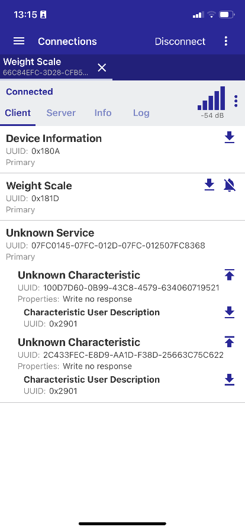
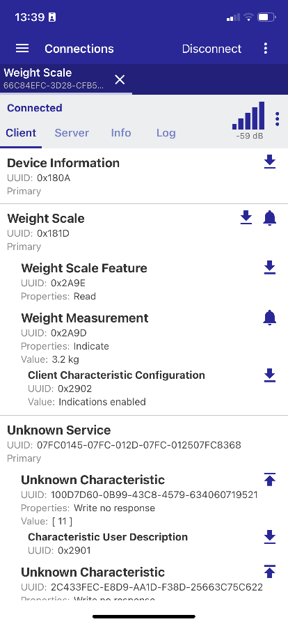

## Example description

Simple example showing how to interface the DA14531 with the [LOAD CELL 2 CLICK Board™](https://www.mikroe.com/load-cell-2-click) which features the Nuvoton NAU7802 bridge sensor ADC via I2C. 
When connected to a BLE central this example allows the measured weight value to be read from the standard BLE weight scale profile. It allows for taring and calibration using custom BLE profiles.

## HW and SW configuration

### **Hardware configuration**

- This example runs on the DA14531 Bluetooth Smart SoC.
- DA14531 daughter board + DA145xxDEVKT-P PRO-Motherboard and a MikroBUS™ Load Cell 2 Click Board™ are required.

### **Software configuration**
- This example requires:
  * [SDK6.0.18](https://www.renesas.com/eu/en/document/swo/sdk601811821-da1453x-da145856?r=1564826).
  * SEGGER’s J-Link tools should be downloaded and installed.

The user manuals for the development kits can be found:

- [Here](https://www.renesas.com/eu/en/document/mat/um-b-114-da14531-development-kit-pro-hardware-user-manual) for the DA145xxDEVKT-P PRO-Motherboard.

## How to run the example

For the initial setup of the project that involves linking the SDK to this SW example, please follow the Readme [here](../../Readme.md).

### Hardware configuration DA14531 using DA145xxDEVKT-P PRO-Motherboard

Connect the Load Cell 2 Click Board™ to the **MikroBUS™ 2** interface on the Development Kit PRO motherboard (this will require soldering sockets into the locations for connectors J17 and J18):

Apply the jumper configuration of the image shown below.

Connect a load cell to the click board like shown in the image below. Make sure the load cell is mounted according to its manufacturer specification.

**NOTE**

When using the I2C interface, **the JTAG/Debug interface will be no longer available** because the **P0_2** is shared between the **SWCLK** and the **I2C clock**.
This is why you can programme the onboard SPI flash with the generated binary and remove after that the JTAG debug Jumpers (J1:21-22 and J1:23-24). 
You can refer to the [section 16:SPI Flash Programmer](https://s3.eu-west-2.amazonaws.com/lpccs-docs.dialog-semiconductor.com/UM-B-083/tools/SPIFlashProgrammer.html) to see how to program the SPI flash with the Smarsnippets Toolbox.

If you would like to use the JTAG interface for debug purpose you have to choose different i2C GPIOs configurations. Be sure to update the `user_periph_setup.h` with the following configuration as an example:

	#define BMP388_I2C_SCL_PORT     GPIO_PORT_0
	#define BMP388_I2C_SCL_PIN      GPIO_PIN_1
	#define BMP388_I2C_SDA_PORT     GPIO_PORT_0
	#define BMP388_I2C_SDA_PIN      GPIO_PIN_3

Then use jumpers wires to establish following connections between the DA145xxDEVKT-P PRO-Motherboard and the sensor click board:
 
	- Connect Vdd to V3 on J2.
	- Connect Gnd to ground on J2.
	- Connect SCL to P21 on J2.
	- Connect SDA to P23 on J2.

### Setup

- Setup a terminal (such as Putty) so you can monitor the UART debug output from the DA14531: 

        - baudrate: 115200
        - data: 8 bits
        - stop: 1 bit
        - parity: None
        - flow control: none

- Build and download the example using the Keil IDE. 

- Run the example using the Keil debugger. (Disconnect the debugger after uploading to allow P0_2 to be used for the I2C interface)

- Monitor the debug output using the terminal you setup in step 3 and you should see the following.

 
- Now connect to the device using a Smart Device running an App such as the Renesas SmartBond™ app . The example advertises with the name "Weight Scale".

- The connection event is printed in the terminal.

- You'll now be able to see a weight scale service and also a service with characteristics that allow taring and calibrating the scale. In the figure below, the top most unknown characteristic is to zero the scale. If a byte of ones is written to this service, the weight scale will be set to zero.

- This can be confirmed in the terminal.

- To calibrate the scale the bottom unknown characteristic is used. A known calibration weight must be put on the weight scale and the weight of that calibration weight should be sent to the characteristic in grams. The type to send is uint32_t.

- The callibration event is printed in the terminal.

- The weight can then be read via BLE by subscribing to the Weight Measurement characteristic as shown below.

## Known Limitations

- There are no known limitations for this example. But you can check and refer to the following application note for
[known limitations for SDK6 devices](http://lpccs-docs.renesas.com/sdk6_kll/index.html)