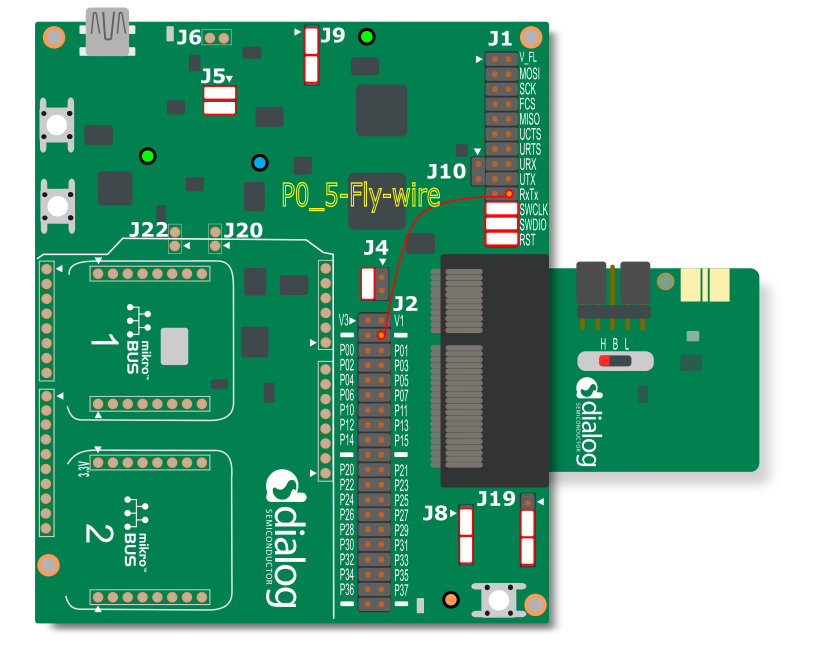
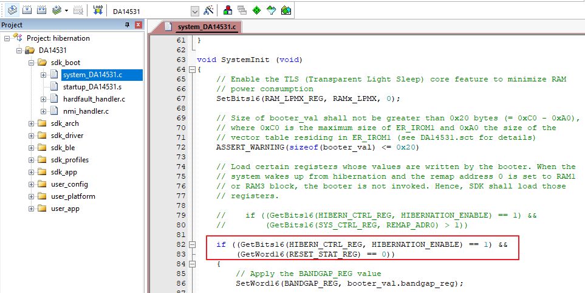
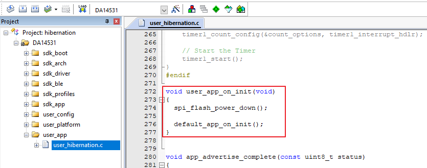
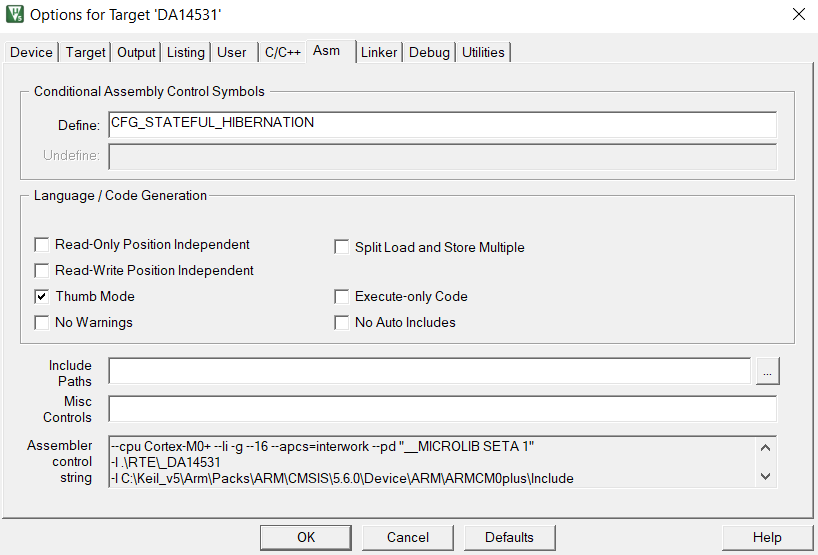
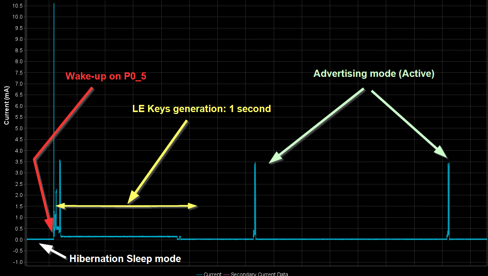

## Hibernation and State aware hibernation

- This project starts with undirected connectable advertising
- In between 2 advertising events extended sleep is applied
- There is a maximum advertising period set
- After the maximum advertising period is over, the device enters hibernation/state-aware hibernation mode
- P0_5 (P2_5 on the DK Pro motherboard) is used to wake up the device from hibernation 

- With respect to the state-aware hibernation, after the device enters the hibernation mode as explained above, external event via GPIO P0_5 (P2_5 on the motherboard) wakes up the device and DA14531 continues execution of application code from where it left before entering hibernation.

Note:
- On wake-up from the hibernation mode, the memory address 0x00 can be remapped either to OTP or ROM when using Flash memory or SysRAM depending on how the device is configured and programmed to handle hibernation wake-up mechanism. 

The expected result of the example can be verified by:
- Connecting the motherboard to the desktop/laptop and observing the power profile in SmartSnippets Studio.


## HW and SW configuration

This example runs on the BLE Smart SoC (System on Chip) devices:
- DA14531 daughter board or DA14531 Tiny Module + DA145xxDEVKT-P PRO-Motherboard.
	
The user manuals for the development kits can be found:
- [here](https://www.dialog-semiconductor.com/products/da14531-development-kit-pro) for the DA145xxDEVKT-P PRO-Motherboard.

- [here](http://lpccs-docs.dialog-semiconductor.com/UM-B-139-Getting-Started-with-DA14531-TINY-Module/index.html) for the DA14531 Tiny Module getting started

To run the program from flash or OTP, please visit chapter 11 of the [SmartSnippets Toolbox User Manual](http://lpccs-docs.dialog-semiconductor.com/SmartSnippetsToolbox5.0.8_UM/index.html )

* **General Hardware configuration DA14531 using DA145xxDEVKT-P PRO-Motherboard**

	- The general hardware configuration remains the same for the 3 use-cases here. Only for the SPI Flash use-case (not for module) we need additional jumper settings.
	- Connect the DA145xxDEVKT-P PRO-Motherboard to the working station through USB1 connector. 

	
	
* **Software configuration**

	- This example requires:
	* SmartSnippets Toolbox v5.0.14
    * [SDK6.0.14.1114](https://www.dialog-semiconductor.com/da14531_sdk_latest)
	* Keil5
	- **SEGGER’s J-Link** tools should be downloaded and installed.

## How to run the example

### Setup
For the initial setup of the project that involves linking the SDK to this SW example, please follow the Readme [here](../../Readme.md).

1. Start Keil using the `hibernation_example.uvprojx` Keil project file.
 
2. Expand the dialog shown in the red box in the image below.

	


3. Select the device: DA14531

4. Compile (F7) the program

5. Open the system_DA14531.c, comment out the following, 

	``` C
		//    if ((GetBits16(HIBERN_CTRL_REG, HIBERNATION_ENABLE) == 1) &&
		//        (GetBits16(SYS_CTRL_REG, REMAP_ADR0) > 1))
	```

	and add the following, 

	``` C
		if ((GetBits16(HIBERN_CTRL_REG, HIBERNATION_ENABLE) == 1) &&
			GetWord16(RESET_STAT_REG) == 0)
	```

	as shown in the figure below
	
		

6. Open the user_hibernation.h and declare the following function,

	``` C
		void user_app_on_init(void);
	```
	
7. Open the user_hibernation.c and add the function, like so, 

	``` C
		void user_app_on_init(void)
		{
			spi_flash_power_down();
			
			default_app_on_init();
		}
	```
		

8. Open the user_callback_config.h, and replace the default_app_on_init with user_app_on_init, like so, 

	``` C
		.app_on_init            = user_app_on_init,
	```
	
	
9. Save and compile 
	
Now we can start implementing the use-cases. 

## Use-case 1 - Hibernation Mode

To demonstrate the hibernation example there are three use-cases that depends on selecting the source of booting of a firmware either from:
1. SPI Flash (address 0 remap to ROM) OR
2. OTP (address 0 remap to OTP) OR 
3. SysRAM (address 0 remap to SysRAM1)

### Using SPI Flash 

To enter the hibernation after booting from SPI Flash, the following software modification needs to be done. 

1. In Keil, Project explorer, open the *user_hibernation.h*

2. In the defines, define CFG_APP_GOTO_HIBERNATION to select the hibernation sleep mode and also define HIBERNATION_SPI and undefine the others,

	``` C
	#if defined (__DA14531__)
		#define CFG_APP_GOTO_HIBERNATION
		
		#define HIBERNATION_SPI
		#undef HIBERNATION_OTP
		#undef HIBERNATION_SYSRAM
	```

3. In the Hibernation mode configuration, this selection switches off all the three RAM blocks and remap the address 0 to ROM as shown below, 

	
	

4. In *user_periph_setup.h* file configure the GPIO that would be used to wake-up the device from hibernation mode. In our case we have chosen P0_5 as the wake-up GPIO. 

	``` C
	/****************************************************************************************/
	/* Wake-up from hibernation configuration                                               */
	/****************************************************************************************/
	#if defined (__DA14531__) 
		#define HIB_WAKE_UP_PORT        GPIO_PORT_0
		#define HIB_WAKE_UP_PIN         GPIO_PIN_5
		#define HIB_WAKE_UP_PIN_MASK    (1 << HIB_WAKE_UP_PIN)
	#endif
	```

5. Specify the advertisement period in the *user_config* file,  

	``` C
	/*
	 ****************************************************************************************
	 *
	 * Default handlers configuration (applies only for @app_default_handlers.c)
	 *
	 ****************************************************************************************
	 */
	static const struct default_handlers_configuration  user_default_hnd_conf = {
		// Configure the advertise operation used by the default handlers
		// Possible values:
		//  - DEF_ADV_FOREVER
		//  - DEF_ADV_WITH_TIMEOUT
		.adv_scenario = DEF_ADV_WITH_TIMEOUT,

		// Configure the advertise period in case of DEF_ADV_WITH_TIMEOUT.
		// It is measured in timer units. Use MS_TO_TIMERUNITS macro to convert
		// from milliseconds (ms) to timer units.
		.advertise_period = MS_TO_TIMERUNITS(18000), //this is for 30s

		// Configure the security start operation of the default handlers
		// if the security is enabled (CFG_APP_SECURITY)
		// Possible values:
		//  - DEF_SEC_REQ_NEVER
		//  - DEF_SEC_REQ_ON_CONNECT
		.security_request_scenario = DEF_SEC_REQ_NEVER
	};

	```

	This will configure the advertising period as 18s after which the device will enter the hibernation mode. To wake-up from hibernation use the P0_5 which was configured before as wake-up GPIO.

6. Save all the changes done in the project and Compile (F7).

7. Program the DA14531 using the compiled hex file and boot from flash. To do this, please refer to chatper 13 SPI Flash Programmer in the [SmartSnippets Toolbox User Manual](http://lpccs-docs.dialog-semiconductor.com/SmartSnippetsToolbox5.0.8_UM/index.html ).
	
	

### Using OTP 

The process is the same as using SPI as we have seen in the previous section, except we define the HIBERNATION_OTP and undefine the rest, 

``` C
#if defined (__DA14531__)
	#define CFG_APP_GOTO_HIBERNATION
	
	#undef HIBERNATION_SPI
	#define HIBERNATION_OTP
	#undef HIBERNATION_SYSRAM
```

This would define the configuration of Hibernation mode to remap the address 0 to ROM while booting. 


After doing this, repeat the steps from 4 - 7. In order to program the OTP and boot from OTP, please refer to chapter 12 OTP programmer in the [SmartSnippets Toolbox User Manual](http://lpccs-docs.dialog-semiconductor.com/SmartSnippetsToolbox5.0.8_UM/index.html ).


### Using SysRAM1

The process is the same as mentioned in previous section, again, except we define the HIBERNATION_SYSRAM and undefine the rest, 

``` C
#if defined (__DA14531__)
	#define CFG_APP_GOTO_HIBERNATION
	
	#undef HIBERNATION_SPI
	#undef HIBERNATION_OTP
	#define HIBERNATION_SYSRAM
```

This would define the configuration of Hibernation mode to remap the address 0 to SysRAM1 while booting. Also since we are running it from SysRAM we need to retain the retention memory blocks. 


After doing this, repeat the steps from 4 - 7. In order to program the OTP and boot from OTP, please refer to chapter 8 Booter in the [SmartSnippets Toolbox User Manual](http://lpccs-docs.dialog-semiconductor.com/SmartSnippetsToolbox5.0.8_UM/index.html ).


## Use-case 2

To demonstrate the state-aware hibernation example, the following software modification needs to be done. 

1. In Keil, Project explorer, open the *user_hibernation.h*

2. In the defines, define CFG_APP_GOTO_STATEFUL_HIBERNATION to select the state aware hibernation mode and undefine CFG_APP_GOTO_HIBERNATION,

	``` C
	#if defined (__DA14531__)	
		#undef CFG_APP_GOTO_HIBERNATION
		#define CFG_APP_GOTO_STATEFUL_HIBERNATION
	```

3. Additionally, CFG_STATEFUL_HIBERNATION shall be defined (in Options for Target 'DA14531' --> Asm --> Conditional Assembly Control Symbols --> Define) 

	


4. In the state aware hibernation mode configuration, this selection switches off all the three RAM blocks and remap the address 0 to ROM as shown below, 

	

5. In *user_periph_setup.h* file configure the GPIO that would be used to wake-up the device from hibernation mode. In our case we have chosen P0_5 as the wake-up GPIO. 

	``` C
	/****************************************************************************************/
	/* Wake-up from hibernation configuration                                               */
	/****************************************************************************************/
	#if defined (__DA14531__) 
		#define HIB_WAKE_UP_PORT        GPIO_PORT_0
		#define HIB_WAKE_UP_PIN         GPIO_PIN_5
		#define HIB_WAKE_UP_PIN_MASK    (1 << HIB_WAKE_UP_PIN)
	#endif
	```

6. Specify the advertisement period in the *user_config* file,  

	``` C
	/*
	 ****************************************************************************************
	 *
	 * Default handlers configuration (applies only for @app_default_handlers.c)
	 *
	 ****************************************************************************************
	 */
	static const struct default_handlers_configuration  user_default_hnd_conf = {
		// Configure the advertise operation used by the default handlers
		// Possible values:
		//  - DEF_ADV_FOREVER
		//  - DEF_ADV_WITH_TIMEOUT
		.adv_scenario = DEF_ADV_WITH_TIMEOUT,

		// Configure the advertise period in case of DEF_ADV_WITH_TIMEOUT.
		// It is measured in timer units. Use MS_TO_TIMERUNITS macro to convert
		// from milliseconds (ms) to timer units.
		.advertise_period = MS_TO_TIMERUNITS(18000), //this is for 30s

		// Configure the security start operation of the default handlers
		// if the security is enabled (CFG_APP_SECURITY)
		// Possible values:
		//  - DEF_SEC_REQ_NEVER
		//  - DEF_SEC_REQ_ON_CONNECT
		.security_request_scenario = DEF_SEC_REQ_NEVER
	};

	```

	This will configure the advertising period as 18s after which the device will enter the hibernation mode. To wake-up from hibernation use the P0_5 which was configured before as wake-up GPIO.

7. Save all the changes done in the project and Compile (F7).

8. Connect P23 (on J2 header of the motherboard) to V3 (J2 header of the motherboard) using a fly-wire. 

9. Run the code from either Keil (RAM) or from SPI flash, the device will start advertising for the selected duration (step 5) and then enter state-aware hibernation mode.

10. Move the fly-wire from V3 to Ground, the device will wake up and the LED D5 (LED D2 on the module) will turn on for a second or two and get turned off. 
	Both the processor state and system register content will be restored – code execution will resume from the point the device went to stateful hibernation.

11. It will enter extended sleep mode (as configured) and will wait for interrupt to occur (button press on SW2 of the motherboard) and it will advertise for the advertisement period set, and will go back to state aware hibernation mode. 

## Expected Result

### DA14531 with DA145xxDEVKT-P PRO-Motherboard
1. Open the Power Profiler in the SmartSnippets Toolbox. please refer to chapter 10 Power Profiler in the [SmartSnippets Toolbox User Manual](http://lpccs-docs.dialog-semiconductor.com/SmartSnippetsToolbox5.0.8_UM/index.html ). 

2. After running the program either from SysRAM, Flash or OTP, the device advertises for 30s and enters the hibernation mode. On wake-up (using the P0_5) the device advertises again. 

	

3. End of example.		


## Troubleshooting

- Try a different USB cable.

- Try different jumper wires, if used.

- Verify using any BLE scanner that the device is advertising. 

- If none of the above helps, please check with the customer support team who would be glad to provide you the solution.

