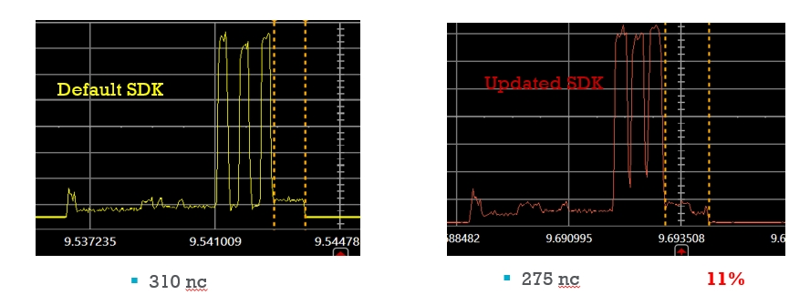
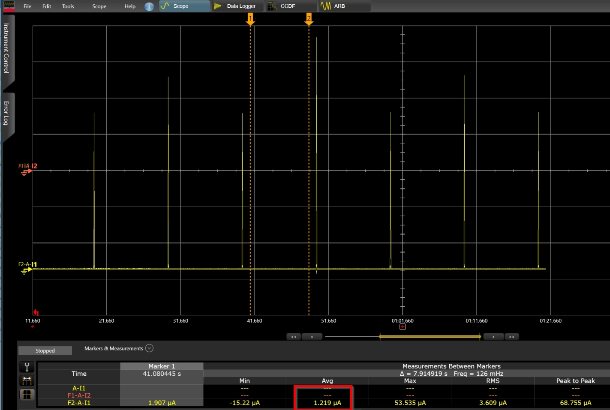

# Optimised Ibeacon example

## Example description

The example demonstrates an optimized software implementation for ibeacon on the DA14531.

The example is an update of the ibeacon SW example: ``BLE_SDK6_examples\connectivity\ibeacon``, below the main modifications, basically we demonstrate how to:

- Alternate Static random address: change the device address in every advertising event
- Alternate Tx output power level: change the Tx output power level in every advertising event
- Alternate User advertising data: change the Beacon advertising payload in every advertising event 

A new ibeacon structure has been created to allow the alternating and the advertising interval is set to 1 s.

Because the example needs changes into the SDK we are providing within the patch directory the patch file: ``patch\SDK6patch.diff``

```` C
/* Set the advertising rate */
#define ADV_INTERVAL_ms							1000
````

```` C
ibeacon_adv_payload_t adv_payload;
ibeacon_adv_payload_t_new adv_payload_new;
````


```` C
if(change_bd_addr_flag % 2)

{
	user_app_adv_start();

	/* Alternate User advertising data*/
	memcpy(store_adv_data, &adv_payload, sizeof(ibeacon_adv_payload_t));
	store_adv_data_len = sizeof(ibeacon_adv_payload_t);

	/* Alternate Tx output power, Set output power to maximum value (0dBm) */
	rf_pa_pwr_set(RF_TX_PWR_LVL_0d0);

	/* Alternate Static random address */
	llm_le_env.rand_add.addr[0] = 0x11;
	llm_le_env.rand_add.addr[1] = 0x12;
	llm_le_env.rand_add.addr[2] = 0x13;
	llm_le_env.rand_add.addr[3] = 0x14;
	llm_le_env.rand_add.addr[4] = 0x15;
	llm_le_env.rand_add.addr[5] = 0x16;

}
else 

{
	user_app_adv_start_new();

	/* Alternate User advertising data*/
	memcpy(store_adv_data, &adv_payload_new, sizeof(ibeacon_adv_payload_t_new));
	store_adv_data_len = sizeof(ibeacon_adv_payload_t_new);

	/* Alternate Tx output power, Set output power to maximum value (+2.5dBm) */
	rf_pa_pwr_set(RF_TX_PWR_LVL_PLUS_2d5);

	/* Alternate Static random address */
	llm_le_env.rand_add.addr[0] = 0x01;
	llm_le_env.rand_add.addr[1] = 0x02;
	llm_le_env.rand_add.addr[2] = 0x03;
	llm_le_env.rand_add.addr[3] = 0x04;
	llm_le_env.rand_add.addr[4] = 0x05;
	llm_le_env.rand_add.addr[5] = 0x06;
}	 

````


In this example we are showing also how to tune the DA14531 for a minimum current consumption.
When the changes are applied to the SDK, the current consumption will be decreased by 18%. 

**Below the list of changes for power improvement:**

- Optimize  the time between Tx pulses

````
rwble.c :

__BLEIRQ void rwble_isr(void)
{
.....
   /* Optimize  the time between Tx pulses */
	ble_advtim_set (500);
}

````


- Lower the clock speed on the AMBA when sleep preparation 

````
arch_system.c :

__WEAK bool app_use_lower_clocks_check(void)
{
	 return true;
}
````


- Remove RCX read and calibration

````
arch_main.c :

#if defined (__DA14531__)
       // rcx20_read_freq(false);
#endif

````

- Reduce RF calibration routine 

````
arch_system.c :

void conditionally_run_radio_cals(void)
{
#if defined (__DA14531__)
#if (USE_RF_LDO_CALIBRATION)
    if (((current_time - last_time) >= 500000) || rf_ldo_calibration_pending)
 

````
- Reduce XTAL32M wait time 

````
otp_cs.c :

#define XTAL32M_WAIT_TRIM_TIME_USEC      (500)  // 500 usec
 
````

- Optimize xtal start-up time

````
arch.h :

#if defined (__DA14531__)
#define HW_STARTUP_TIME_IN_XTAL32K_CYCLES    (5)   // 5 LP clocks for startup state machine handling
#define HW_STARTUP_TIME_IN_RCX_CYCLES        (3)    // 3 LP clocks for startup state machine handling
#define RCX_BLE_PWR_UP_TO_SLP_IRQ_USEC       (30)
#define XTAL32K_BLE_PWR_UP_TO_SLP_IRQ_USEC   (30)
#endif
 
````

The results are given in the below screenshots:

- Average power consumption  with no software optimization : **2,77 uA**


- Average power consumption  with software optimization : **2,27 uA**


- Average power consumption during sleep : **1,2 uA**



**Estimate battery life**

Battery life can be calculated when you know the average current consumption of the device and the energy capacity of your battery.
Battery Lifetime Estimator tool can be used and it can be loaded (from the Smartsnippets toolbox) by selecting the “Power Monitor” under Layout in the Toolbar or the “Battery Lifetime Estimator” under Tools.

## HW and SW configuration


* **Hardware configuration**

- This example runs on the DA1453x (DA14531-00, DA14531-01 and DA14535) Bluetooth Smart SoC devices.
- The user manuals for the development kits can be found [Here](https://www.renesas.com/us/en/products/wireless-connectivity/bluetooth-low-energy/da14531-00fxdevkt-p-smartbond-tiny-da14531-bluetooth-low-energy-51-system-chip-development-kit-pro) for the DA145xxDEVKT-P PRO-Motherboard.
- For the DA14531 getting started guide you can refer to [UM-B-117](https://lpccs-docs.renesas.com/UM-B-117-DA14531-Getting-Started-With-The-Pro-Development-Kit/index.html)

- For the DA14535 getting started guide you can refer to this [UM-B-165](https://lpccs-docs.renesas.com/DA14535/UM-B-165-DA14531-Getting-Started-With-The-Pro-Development-Kit/index.html#device-family-getting-started-with-the-pro-development-kits)

	
* **Software configuration**

	- This example requires:
    	- [SDK6 latest version](https://www.renesas.com/sdk6_latest)
    	- **SEGGER’s J-Link** tools should be downloaded and installed.

## How to run the example

For the initial setup of the project that involves linking the SDK to this SW example, please follow the Readme [here](../../Readme.md).

### Initial Setup

1.  Build and download the example using the Keil IDE. 
2.  Run the example using the Keil debugger.
3.  Use a Smart Device running an App such as Locate to view the beacons transmitted by the DA14531.

## Further reading

- [Wireless Connectivity Forum](https://lpccs-docs.renesas.com/lpc_docs_index/DA145xx.html)


## Known Limitations

- There are no known limitations for this example. But you can check and refer to the following application note for
[SDK6 known limitations](https://lpccs-docs.renesas.com/sdk6_kll/index.html)

## Feedback and support ?

If you have any comments or suggestions about this document, you can contact us through:

- [Wireless Connectivity Forum](https://community.renesas.com/wireles-connectivity)

- [Contact Technical Support](https://www.renesas.com/eu/en/support?nid=1564826&issue_type=technical)

- [Contact a Sales Representative](https://www.renesas.com/eu/en/buy-sample/locations)


