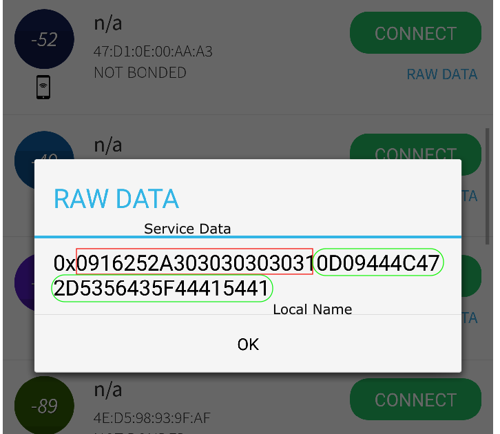

# DA1453x and DA14585/586 Service Data Beacon

## Example description

The main purpose of this software example is to demonstrate creating a **Non-Connectable Advertising** application example that includes service data.   Specifically, this example illustrates the idea of 
including Service Data from a 16-bit UUID as defined by the Bluetooth SIG.  [Bluetooth SIG GAP Flags](https://www.bluetooth.com/specifications/assigned-numbers/generic-access-profile/).
This example uses the Device Information Service, Serial Number characteristic.

## Non-Connectable Advertising

For getting more information about the Non-Connectable Advertising, please refer to [Advertising Tutorial](https://www.dialog-semiconductor.com/sites/default/files/advertising_concept.pdf) from our [support website](https://www.dialog-semiconductor.com/bluetooth-low-energy).

## HW and SW configuration

- **Hardware configuration**
  - This example runs on the DA14531, DA14585/586 Bluetooth Smart SoC devices.
  - The DA1458x / DA145xx Pro Development kit is needed for this example with default jumper configuration..
  - Connect the USB Development kit to the host computer.
- **Software configuration**
  - Download the [SDK6 latest version](https://www.renesas.com/sdk6_latest)
  - **SEGGER’s J-Link** tools should be downloaded and installed.
  - A smartphone with a BLE scanning app (for example **BLE scanner** on Android or **Lightblue** on IOS).
  - A BLE Sniffing tool is also useful; though not mandatory .

## How to run the example

### Initial Setup

For the initial setup of the project that involves linking the SDK to this SW example, please follow the Readme [here](https://github.com/dialog-semiconductor/BLE_SDK6_examples).

- For the DA14585/586 getting started guide you can refer to this [link](http://lpccs-docs.dialog-semiconductor.com/da14585_getting_started/index.html).
- For the DA14531 Getting started guide you can refer to this [link](https://www.dialog-semiconductor.com/da14531-getting-started).
- For the DA14535 Getting started guide you can refer to this [link](https://lpccs-docs.renesas.com/DA14535/UM-B-165-DA14531-Getting-Started-With-The-Pro-Development-Kit/index.html).

## Software Configuration
Download the latest version of Renesas SDK6.
Install SEGGER’s J-Link tools.
If using e² studio with LLVM instead of Keil, ensure your project settings are adjusted accordingly (instructions below).

## Using e² studio with LLVM
Setup for e² studio
#. Switching to e² studio: Instead of using Keil, you can use e² studio with LLVM as the compiler toolchain. Make sure your project is configured for LLVM by selecting the appropriate toolchain in e² studio.

#. Compile and Build: Open your project in e² studio and compile using LLVM. Ensure your environment variables and paths are properly set for the Renesas toolchain.

#. Run and Debug: Connect your device, set the proper debug configuration in e² studio, and start debugging using J-Link.

By switching to e² studio and LLVM, you can take advantage of advanced debugging tools and an open-source toolchain, while maintaining full compatibility with Renesas DA145xx devices.

For detailed steps on using e² studio, refer to the Renesas e² studio User Guide available on the [Renesas website](https://lpccs-docs.renesas.com/e2_studio_sdk6_getting_started/index.html).

### Compile & Run

- Navigate to ``project_environment`` folder and open the **Keil** project, svc_data_beacon
- Select the target device you are building for, like so,

- Compile (F7) and launch (ctrl + F5) the example.
- You can also download the firmware into SPI Flash. To download the firmware into SPI Flash, the  SPI Flash programmer from SmartSnippets Toolbox should be used as described 
  [here](http://lpccs-docs.dialog-semiconductor.com/UM-B-083/index.html), or the stand-alone flash programmer. 
- The serial number characteristic is a string that is set in user_profiles_config.h.  Be sure to change the length accordingly, if you wish to modify this.  
- This example includes two advertising structures, 1) GAP_LOCAL_NAME 2) Device Serial Number.

To verify please take a look at the BLE sniffer log data, like so,

- The data can be seen in any basic sniffer. Notice the two advertising element structures are readily recognized by the sniffer since they comply to the BLE standard.

- Using an app such as BLE scanner, the raw bytes can be readily seen as well.  Look for DLG-SVC_DATA and select raw data, like so,

	

## Note
This example can be built by e2studio and LLVM compiler instead of using Keil.

## How it works
- This example illustrates the basics behind using standard Bluetooth SIG practices for placing advertising ``elements`` into advertising payload.
- The standard practice for adding a single advertising element consists of the following:  
  {1-byte length_byte} , {1-byte gap flag}, {payload}.
- The length byte includes the gap flag and the total length of the payload.  The helper function in this example requires the user to specify the .len as the length of the payload.  In the serialization, the value of 1 is added to the length to adhere to standard BLE practices. 
- In this specific case, the GAP flags shows a reference to the Core Supplement, Section A part 1.11.  [link](https://www.bluetooth.org/docman/handlers/DownloadDoc.ashx?doc_id=480305).
- We are using 16-bit service Data, since we are exposing the serial number from the Device Information Service.  
- Referencing the core supplement, the payload requires the first two bytes to be the UUID, followed by the service data. 

## Further reading

- [Wireless Connectivity Forum](https://lpccs-docs.renesas.com/lpc_docs_index/DA145xx.html)

## Known Limitations

- There are no known limitations for this example. But you can check and refer to the following application note for
[SDK6 known limitations](https://lpccs-docs.renesas.com/sdk6_kll/index.html)

## Feedback and support ?

If you have any comments or suggestions about this document, you can contact us through:

- [Wireless Connectivity Forum](https://community.renesas.com/wireles-connectivity)

- [Contact Technical Support](https://www.renesas.com/eu/en/support?nid=1564826&issue_type=technical)

- [Contact a Sales Representative](https://www.renesas.com/eu/en/buy-sample/locations)

