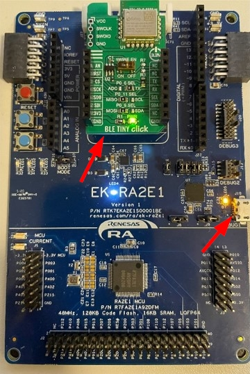
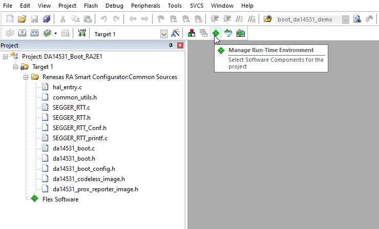
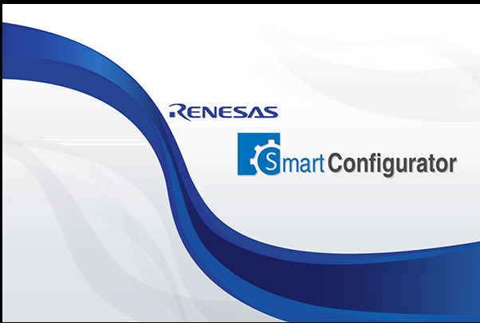
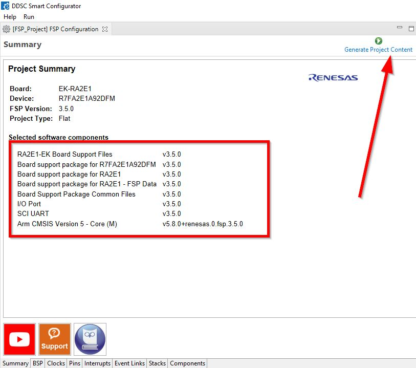
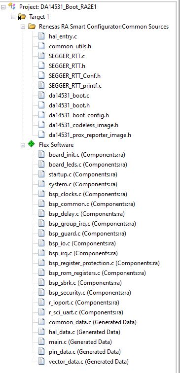
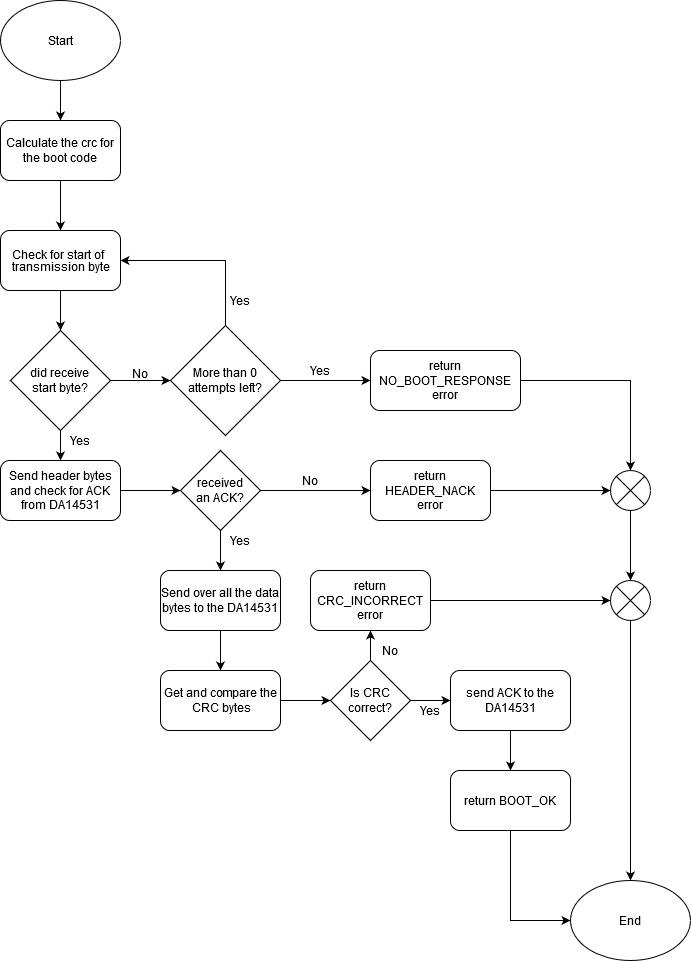

# Booting the DA14531 with Proximity Reporter through a R7FA2E1 from RENESAS (EK-RA2E1)

---
## Example description

The DA14531 has an integrated ARM Cortex M0+ and can be used for programming and controlling the SoC. 
Due to the small form factor the ARM Cortex has its limitations. A solution for the limitations of the integrated microprocessor can be to use an external microprocessor. 
To control the DA14531 with this microprocessor some code is still needed on the DA14531. 
Fortunately, the DA14531 can execute code from RAM that can be loaded in during its boot sequence. 
This way a microcontroller can load a program onto the DA14531.

The goal of this example is to show how to load a program into the RAM of the DA14531 via a R7FA2E1 (EK-RA2E1) microcontroller. 
This example shows the flow of the code and how it can be configured. The program that is booted on the DA14531 in this example is the proximity reporter. 
The interface that is used for booting is two UART. 

## HW and SW configuration

### Required hardware

- A pc workstation
- [RA2E1 Evaluation Kit](https://www.renesas.com/us/en/products/microcontrollers-microprocessors/ra-cortex-m-mcus/ek-ra2e1-evaluation-kit-ra2e1-mcu-group) from Renesas.
- A DA14531 Clickboard [BLE TINY click](https://www.mikroe.com/ble-tiny-click).
- SEGGER J-Link
- (optional) DA14531 Development Kit Pro Motherboard

### Hardware configuration using the RA2E1 and the MikroE BLE TINY click
- Connect the micro USB end of the micro USB device cable to micro-AB USB Debug port (J10, DEBUG1) of the EK-RA2E1 board.
- Put the DA14531 Clickboard in the MikroElektronika™ mikroBUS connector slot of the RA2E1 Dev kit: J21-J22.


- There is some HW rework on the RA2E1 in the reset line of the MikroElektronika™ mikroBUS. The 10K pull up resistor R12 should be removed, this is because the DA14531 reset is active high.


### Software configuration

**Supported Toolchains:**

- Keil MDK (v5.29 or higher) and ARM compiler 6 (version 6.13 or higher) 
- Renesas e² studio IDE V21.7 or greater

**Supported Emulator Devices:**

- SEGGER J-Link tools should be downloaded and installed.

**Bluetooth® Explorer Tool**

- BLE scanner for your smartphone (in this example we are using LightBlue® Explorer (iOS))

**Renesas Flexible Software Package (FSP) Installation**


*Installing the FSP with KEIL MDK ARM*

When using a KEIL MDK ARM IDE, you can use the Renesas RA Smart Configurator to configure the software system for a Renesas RA microcontroller. 
The RA Smart Configurator (RA SC) is a desktop application designed to configure device hardware, such as clock setup and pin assignment, as well as initialization of FSP software components for a Renesas RA
To download and install the RA SC Installer, visit the [GitHub](https://github.com/renesas/fsp/releases) page of Flexible Software Package (FSP) for Renesas RA MCU Family.
Search for the RA SC installer and download it (for example, `setup_fsp<version>_rasc_<version >.exe`).

- Open the Keil project
- Now click on Flex Software to Manage Run-time Environment tab.



- Click the green run button next to RA Configuration in the Flex Software tree. 


- Then the RASC will be launched with project generator wizard.



- In the RA Configuration window, click the Generate Project Content button.



- After clicking Generate Project Content button in the RA Smart Configurator, return to KEIL μVision. 
KEIL μVision offers a dialog box to import the changes and updates to the project made in RASC. Select Yes to import the updated project and the project is ready to build.


- RASC will place the necessary FSP source code and header files into the project workspace.



*Installing the FSP with e² studio Installer*

The FSP with e² studio Installer includes the e² studio tool. To download and install the FSP with e² studio Installer, follow the steps below:

- Visit the [GitHub](https://github.com/renesas/fsp/releases) page of Flexible Software Package (FSP) for Renesas RA MCU Family.
- Select FSP with e² studio Installer (for example, `setup_fsp<version>_e2s_<version >.exe`) and click the link to download directly.
- Launch e² studio 
- Open the FSP configuration and then click on Generate Project Content button to generate the source code content.


**Flow of the code**




## Expected Result

After about 5 seconds when the run button is pressed the DA14531 should start advertising itself as **DLG-PROXR** (this is the standard advertising name for Proximity reporter project). 
Down below a screenshot can be seen from the LightBlue® after the boot was successful.


## 1 Wire UART settings

The booting process has two options one wire UART and two wire UART, in this example the booting process is **done through two wire UART**. 

This can be configured by enabling the `ONE_WIRE` flag in `boot_da14531.h` file.

```c
/* Enable/Disable one wire UART*/
#undef ONE_WIRE to the booting function.
```
on the Tiny click board enable the 1 wire UART by Put the switch to the ON position.


## Known Limitations

- Refer to the following application note for DA14531 known [hardware limitations](https://www.dialog-semiconductor.com/da14531_HW_Limitation)
- Also refer to Dialog Software [Forum Link](https://support.dialog-semiconductor.com/forum)
