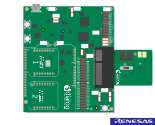
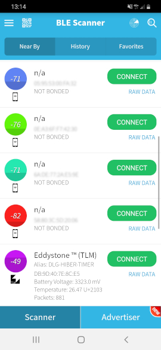

# BLE Eddystone beacon with hibernation or deep sleep mode

## Example description

This example configures a DA14531 device to be used as an Eddystone beacon. The beacon advertises with a random static device address for a set amount of time, after which it drops to hibernation mode or deep-sleep mode. While advertising, the device will utilize the extended-sleep mode in between advertising events. The advertising data include the number of Advertisement PDUs and the temperature acquired by the die sensor. The system wakes up from the real-time clock in deep-sleep mode, or from an external timer upon a GPIO toggle in hibernation mode.

## HW and SW configuration
- This example runs on the DA14531 Bluetooth Smart SoC devices.	
- The DA145xx Pro Development Kit is needed for this example, and it can be used with the DA14531 daughterboard evaluation kits.

### Hardware configuration for use in deep-sleep mode

- Connect the USB1 connector of the DA145xx Pro Development Kit to the host computer.
- Connect the SPI flash and JTAG debugger with the appropriate jumpers on header J1.
	
	

### Hardware configuration for use in hibernation mode

- Connect the USB1 connector of the DA145xx Pro Development Kit to the host computer.
- Configure your external timer according to the manufacturer's instructions and connect the wake-up signal of your external timer to P25 of header J2. 

	For this example we used Texas Instruments' TPL5010EVM, in which case you would have to connect the WAKE pin of the module to P25, as well as the DONE pin of the module to P24 of header J2 on the motherboard. If you prefer to supply your external timer from the motherboard, you have to connect the V3 pin of J2 header to AUX_VDD, and the ground pin of the timer to any ground pin (marked with a dash) on the motherboard. Trim the variable resistance to your preferred wake-up time interval.

	You can see the jumper configuration below.

	

### Software configuration

 This example requires:
 - SDK v6.0.14 or later
 - **SEGGER’s J-Link** tools should be downloaded and installed.
 - Additionally, an application like BLE Scanner from Bluepixel Technologies should be used to check advertising of our beacon. It can be found on [Google Play](https://play.google.com/store/apps/details?id=com.macdom.ble.blescanner) or on the [App Store](https://apps.apple.com/us/app/ble-scanner-4-0/id1221763603).

## How to run the example

For the initial setup of the project that involves linking the SDK to this SW example, please follow the Readme [here](https://github.com/dialog-semiconductor/BLE_SDK6_examples).

### Initial Setup

 - Start Keil
 - Open the header file ``src/user_hibernation_timer.h`` and define either the ``CFG_HIBERNATION_MODE`` or ``CFG_DEEP_SLEEP_MODE`` guard to use the sleep mode you prefer. Make sure to leave the other one undefined.
 - Compile the example. In the deep-sleep or hibernation mode, we can't have the debugger attached, so we can't run the example in a debug session. 
 
	**In deep sleep mode, the DA14531 will initiate a hardware reset on wake-up, and for this reason we would need to load the executable in the SPI flash.** You can find more information on how to use the SmartSnippets Toolbox and the SPI Flash Programmer in the [User Manual for the SmartSnippets Toolbox](http://lpccs-docs.dialog-semiconductor.com/SmartSnippetsToolbox5.0.8_UM/index.html).

 	For the hibernation mode, follow the next steps to load your executable and run it without the debugger attached. 

    Start a debugging session.
	

	Stop the debug session. The debugger will detach and your code will run on the DA14531 in the background.
	

 ### Inspecting the beacon data
 The following instructions are using the BLE Scanner app.
 - Start the BLE Scanner. The application will list all the Bluetooth devices that are advertising. 
 - Find the Eddystone beacon, advertising with the name ``DLG-HIBER-TIMER``.
 	
	 

   You can inspect in the beacon's telemetry data the device's battery level, the die temperature, and the advertising counter.

### Configuring the example
The configuration options are local to the ``user_hibernation_timer.c`` file and you can adjust them with the appropriate defines.

- ``ADV_TIMER_CANCEL_TIMEOUT``: The duration of advertising. The device will drop to extended-sleep mode in between advertising events.
- ``DONE_TIMER_TIMEOUT``: Used to deassert the DONE signal of the TPL5010 in hibernation mode.
- ``RTC_TIMEOUT``: The time after which the real-time clock will wake the system up from deep-sleep mode.

## Known Limitations

- There are no known limitations for this example. But you can check and refer to the following application note for [known hardware limitations for DA14531 devices](https://www.dialog-semiconductor.com/da14531_HW_Limitation).
- Dialog Software [Forum link](https://www.dialog-semiconductor.com/forum).
- You can also refer to the [DA14531 Getting Started guide](https://www.dialog-semiconductor.com/da14531-getting-started).

